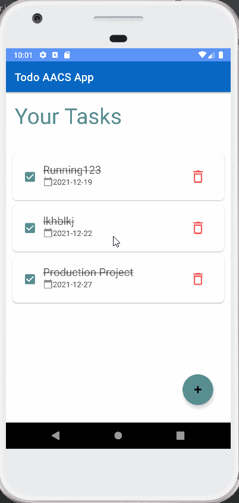

# TodoAacs

This is Todo App written in Java for Android.



## Installation
- Download the source or clone it
- Open the project in Android Studio
- Build gradle and run it.


## Description

- One Mai Activity & Two Fragments, one for listing todos and other for creating, and editing todo 
- Card list item
- CheckBox for completed todos
- Delete todo in one click
- Rotation Problem fix

## Tools & Technology

- Android Studio IDE
- Java
- XML
- MVVM Architecture
- Recycler View, Card View
- Crud with Room Datebase
- Architechture Components:
   - View Binding
   - Lifecycle aware component: View Model, LiveData (Observer Pattern)

## Dependencies

```
implementation 'androidx.appcompat:appcompat:1.4.0'  
implementation 'com.google.android.material:material:1.4.0  
implementation 'androidx.constraintlayout:constraintlayout:2.1.2'  
implementation 'androidx.legacy:legacy-support-v4:1.0.0'

implementation 'androidx.lifecycle:lifecycle-livedata-ktx:2.4.0'  
implementation 'androidx.lifecycle:lifecycle-viewmodel-ktx:2.4.0'  
implementation "androidx.lifecycle:lifecycle-common-java8:2.4.0"  

implementation "androidx.room:room-runtime:2.4.0"  
annotationProcessor "androidx.room:room-compiler:2.4.0"  
androidTestImplementation "androidx.room:room-testing:2.4.0"  

testImplementation 'junit:junit:4.13.2'  
androidTestImplementation 'androidx.test.ext:junit:1.1.3'  
androidTestImplementation 'androidx.test.espresso:espresso-core:3.4.0'  
```

## Contribution
Feel free to `fork` this project and add whatever you like (Though helping would be great). If you have any suggestions or any comments please feel free to contact me or to open an issue.

## License
[MIT License](./LICENSE)
